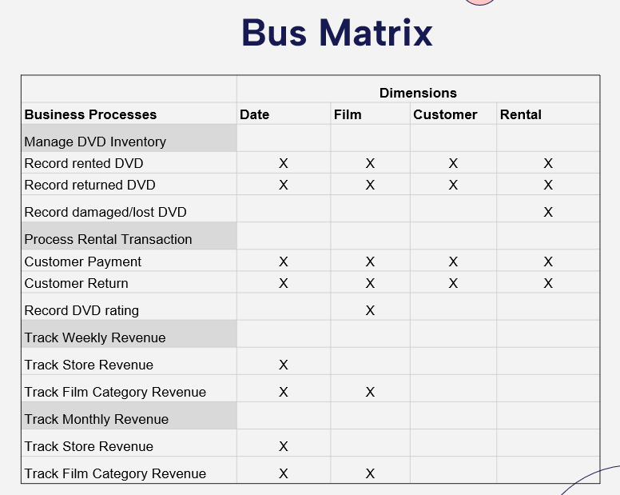

# Movie Data Warehouse Project

The project aims to implement the ER Model of the movie rental database into the data warehouse. Utilize the data warehouse to build the dashboard that shows the business information about the rental business. The project divides into the objective, business matrix, data warehouse architecture, data warehouse implementation, business analysis, and intelligence. The company uses BI information to make better decisions about the rental business.

# Entity Relational Model
* The data source used in this project was a reference to the source. 
https://www.postgresqltutorial.com/postgresql-getting-started/load-postgresql-sample-database/

# Objective
* Segment customers based on popular / preferable Film Category 
* Decision-making based on Revenue by Film Category  
* Source Films based on seasonality (trends by week, month)

# Business Matrix

# Dimensional Model

# Data Warehouse Architecture
* Main Sources: customer, rental, inventory, payment, category, film_category, and film_category

# Techonology
* Azure Blob Storage
* Data Lake Storage
* Synapse Studio
* Data Flow/Pipeline

# Extract

* Create a dataflow pipeline that runs to the for loop to extract and copy data sources into the Staging Area.

# Transform & Load Pipelines (Dataflow)
* Transform data and load data into the Presentation Stage
* Create Five pipelines to create four Dimensional Tables and one Fact Table. 

## DimCustomer 

## DimFilm 

## DimRental

## DimRentalDate

## FactRenal

# Presentation - Data Visualization
* Utilize PowerBI to create a data visualization of the main objective for the store revenues matrix.

# Finding
* Most Popular Film Category: Sports, Sci-fi, and Animation.
* Highest Monthly (Revenue): July
